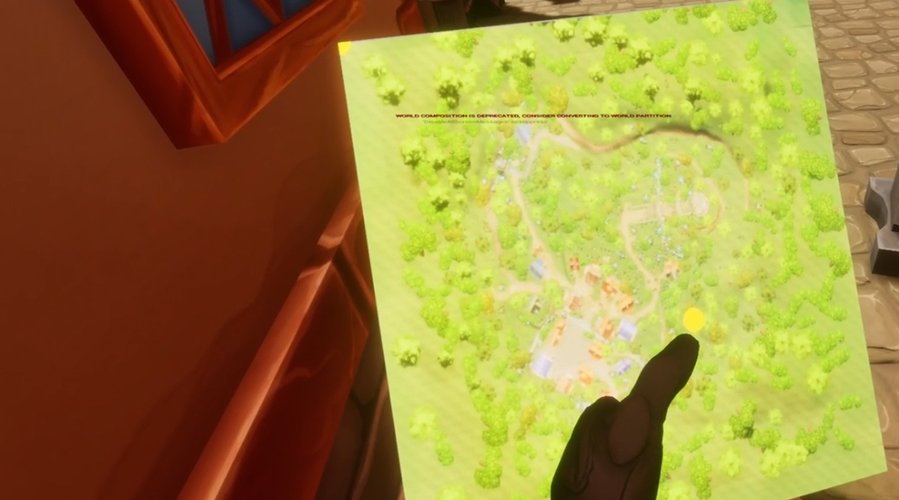

# 🏴 VR Capture the Flag – Multiplayer VR Game in Unreal Engine

A multiplayer VR game for up to 4 players, built in Unreal Engine as part of a Virtual Reality Applications course. Inspired by classic capture-the-flag mechanics, set in a hand-painted fairytale world.

---

## 📸 Screenshots

### Overview / Map
<!-- ADD SCREENSHOT: Wide shot of the fairytale map -->

### Gameplay – Crystal & Target Area
<!-- ADD SCREENSHOT: Pink crystal and the ruin target area -->

### Inventory System
<!-- ADD SCREENSHOT: Left hand inventory with crystal or wand -->

### Minimap
<!-- ADD SCREENSHOT: Right hand minimap (wrist gesture) -->

### Wand & Combat
<!-- ADD SCREENSHOT: Player holding wand / shooting -->

---

## 🎮 Game Concept

Players are spawned at randomized starting positions on a fairytale map. A pink crystal (the flag) spawns at a random location on the map. The goal is to find the crystal, pick it up, and bring it to the target area (a ruin) to win.

Other players can interfere by shooting with a wand – if a player carrying the crystal is hit, the crystal drops and respawns at a new random location.

---

## ✨ Features

| Feature | Description | Points |
|---|---|---|
| **Inventory System** | Attached to left hand; holds one item (crystal or wand). Crystal must be placed in inventory within 3 seconds or it is lost. | 0.5 |
| **Locomotion** | Movement via swinging hand gestures – no helper object required | 1.0 |
| **Minimap** | Attached to right hand; appears via wrist-watch gesture; shows all player positions | 0.5 |
| **Spatial Sound** | Wands emit proximity sound – the closer a player gets, the louder it becomes | 1.0 |

---

## 🗺️ Map & Assets

The fairytale environment was built using the following assets from Fab (Unreal Marketplace):

- **HandPaintedEnvironment** – Main fairytale map with buildings, paths, trees and crystals
- **Wand** – 3D mesh for the wand item
- **StylizedDomeShader** – Material for the sphere highlighting the target area at the ruin

---

## 🕹️ Interaction Methods

- **Crystal pickup & transport** – Pick up the pink crystal and place it in your inventory to carry it to the target
- **Wand shooting** – Shoot other players to make them lose the crystal; replicated for all players
- **Minimap** – Triggered by a wrist-watch gesture on the right hand
- **Locomotion** – Swinging hand movement to walk through the map

---

## 🎥 Videos

Two gameplay videos are available:

- `video_singleplayer.mp4` – Full functionality demonstrated in single player mode
- `video_multiplayer.mp4` – Multiplayer mode (limited functionality due to replication bugs)

<!-- ADD: Upload videos to YouTube/Vimeo and link here -->
<!-- [▶ Watch Singleplayer Gameplay](https://youtube.com/...) -->

---

## ⚠️ Known Limitations (Multiplayer)

The game works as described in single player. In multiplayer, the following issues exist:

- **Client locomotion lag** – The client cannot walk at the same speed as the server; this is hardware-dependent and mainly occurs with Oculus Meta Quest
- **Hand & rotation replication** – Client hand positions and rotations are not reliably synced through the server (finger movement replication works)
- **Object replication** – The pink crystal and wands disappear on the client side when grabbed by the server; grabable object replication in Unreal behaves differently than standard actors
- **Winner widget** – Does not spawn correctly in multiplayer due to unresolved crystal ownership tracking

---

*Developed as part of the Virtual Reality Applications course – TU Wien, December 2025*# VR-Project
